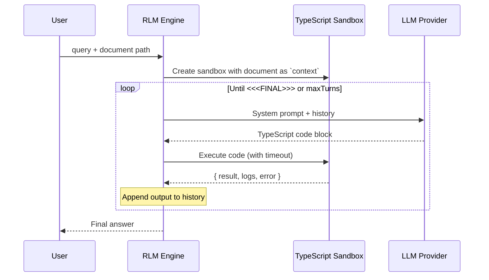

# Recursive Language Model (RLM)

Process documents 100x larger than your LLM's context window—without vector databases or chunking heuristics.

## The Problem

LLMs have fixed context windows. Traditional solutions (RAG, chunking) lose information or miss connections across chunks. RLM takes a different approach: the model writes code to explore documents programmatically, deciding at runtime how to decompose and analyze the data.

Based on the [Recursive Language Models paper](https://arxiv.org/abs/2512.24601).

## Installation

```bash
git clone https://github.com/yogthos/Matryoshka.git
cd Matryoshka
npm install
```

Configure your LLM provider in `config.json`:

```json
{
  "llm": {
    "provider": "ollama"
  },
  "providers": {
    "ollama": {
      "baseUrl": "http://localhost:11434",
      "model": "qwen3-coder:30b",
      "options": { "temperature": 0.2, "num_ctx": 8192 }
    },
    "deepseek": {
      "baseUrl": "https://api.deepseek.com",
      "apiKey": "${DEEPSEEK_API_KEY}",
      "model": "deepseek-chat",
      "options": { "temperature": 0.2 }
    }
  }
}
```

## Usage

### CLI

```bash
# Basic usage
npx tsx src/index.ts "Summarize this document" ./path/to/document.txt

# With options
npx tsx src/index.ts "Find all error codes" ./logs.txt --max-turns 15 --verbose

# See all options
npx tsx src/index.ts --help
```

### MCP Server

For integration with Claude Desktop or other MCP clients:

```bash
npx tsx src/mcp-server.ts
```

### Programmatic

```typescript
import { runRLM } from "./src/rlm.js";
import { createLLMClient } from "./src/llm/index.js";

const llmClient = createLLMClient("ollama", {
  baseUrl: "http://localhost:11434",
  model: "qwen3-coder:30b",
  options: { temperature: 0.2 }
});

const result = await runRLM("What are the main themes?", "./book.txt", {
  llmClient,
  maxTurns: 10,
  turnTimeoutMs: 30000,
});
```

## Architecture



### Components

| Component | Purpose |
|-----------|---------|
| **RLM Engine** | Orchestrates the turn loop, builds prompts, extracts answers |
| **Sandbox** | Isolated VM executing LLM-generated TypeScript with timeout protection |
| **Tools** | `text_stats()`, `fuzzy_search()`, `llm_query()` available in sandbox |
| **Memory** | Persistent array for accumulating findings across turns |

### How It Works

1. Document loads into sandbox as read-only `context` variable
2. LLM receives system prompt with available tools and writes TypeScript
3. Code executes in sandbox, results feed back to LLM
4. LLM iterates until it outputs `<<<FINAL>>>answer<<<END>>>`
5. Sub-queries via `llm_query()` enable recursive decomposition

### Safety

- Sandbox isolates code execution (no filesystem, network, or process access)
- Configurable timeout per turn
- `maxSubCalls` limit prevents infinite recursion
- Sub-LLM calls receive only the prompt, never parent context

## Troubleshooting

### Model Answers Immediately Without Exploring

**Symptom**: The model provides an answer on the first turn without running any code, often with hallucinated data.

**Cause**: Smaller or less capable models may not follow the instruction to explore via code before answering. They may guess at answers based on the query alone.

**Solutions**:

1. **Use a more capable model** - Models like `deepseek-reasoner` or larger Ollama models follow instructions better
2. **Make your query more specific** - Instead of vague queries, be explicit about what to search for:
   ```bash
   # Vague (may cause hallucination)
   npx tsx src/index.ts "What are the sales figures?" ./report.txt

   # Specific (guides exploration)
   npx tsx src/index.ts "Search for SALES_DATA entries and sum the dollar amounts" ./report.txt
   ```
3. **Include data patterns in your query** - If you know how data is formatted, mention it:
   ```bash
   npx tsx src/index.ts "Find lines matching 'Total:' and extract the numbers" ./data.txt
   ```

### Max Turns Reached Without Answer

**Symptom**: Output shows "Max turns (N) reached without final answer"

**Cause**: The model keeps exploring but never terminates properly.

**Solutions**:

1. Increase `--max-turns` for complex documents
2. Check if the model is stuck in a loop (verbose output will show repeated patterns)
3. Simplify the query to require less exploration

### Sandbox Execution Errors

**Symptom**: Repeated "Error: Unexpected token" or similar JavaScript errors

**Cause**: The model is generating invalid JavaScript code.

**Solutions**:

1. The system auto-fixes common issues (missing semicolons, imports)
2. If errors persist, try a different model - some are better at generating valid code
3. Check `--verbose` output to see what code the model is generating

## Development

```bash
# Run tests
npm test

# Run with coverage
npm test -- --coverage

# E2E tests (requires Ollama)
RUN_E2E=1 npm test -- --run tests/e2e.test.ts
```

## References

- [RLM Paper](https://arxiv.org/abs/2512.24601)
- [Original Implementation](https://github.com/alexzhang13/rlm)
- [Blog Post](https://alexzhang13.github.io/blog/2025/rlm/)
